# Enterprise SIEM/SOC Lab: Real-Time Network Threat Detection with Suricata IDS & ELK Stack


A production-grade Network Security Monitoring (NSM) and Security Operations Center (SOC) testbed deployed natively on Ubuntu Server. This project captures raw network traffic using **Suricata IDS**, structures and normalizes high-fidelity alert metadata through **Filebeat (ECS)**, stores and indexes logs in **Elasticsearch**, and visualizes threat vectors via **Kibana Dashboards** against active web exploit campaigns launched from **Kali Linux**.

---

## Table of Contents
1. [Architecture & Pipeline Overview](#1-architecture--pipeline-overview)
2. [Network & Host Topology](#2-network--host-topology)
3. [Suricata IDS Engine & Rule Engineering](#3-suricata-ids-engine--rule-engineering)
4. [Infrastructure Setup & Service Pipeline](#4-infrastructure-setup--service-pipeline)
5. [Attack Simulation & Detection Scenarios](#5-attack-simulation--detection-scenarios)
6. [SOC Security Operations Dashboard](#6-soc-security-operations-dashboard)
7. [Engineering Challenges & Troubleshooting (Post-Mortem)](#7-engineering-challenges--troubleshooting-post-mortem)
8. [Repository Structure](#8-repository-structure)

---

## 1. Architecture & Pipeline Overview

The detection pipeline mirrors an enterprise SecOps environment where an intrusion detection system operates out-of-band to inspect ingress/egress network flows, shipping structured security telemetry into an analytical data lake without introducing latency into web application operations[cite: 12].

```text
========================================================================================
                                LAB ARCHITECTURE & DATA FLOW
========================================================================================

  [ Attacker Machine ]                     [ User / Management Workstation ]
      Kali Linux                                    Windows Host
    208.100.26.148                                  208.100.26.1
          |                                               |
          +-----------------------+-----------------------+
                                  |
                                  | (HTTP :4280 / SSH :22)
                                  v
+--------------------------------------------------------------------------------------+
|                     MONITORING & TARGET SERVER (Ubuntu Server 26.04)                 |
|                                    IP: 208.100.26.166                                |
|                                                                                      |
|   +------------------------------------------------------------------------------+   |
|   |                  Physical / Promiscuous Network Interface                    |   |
|   |                                   ens33                                      |   |
|   +---------------------------------------+--------------------------------------+   |
|                                           |                                          |
|                     +---------------------+---------------------+                    |
|                     | (Kernel AF_PACKET)                        | (TCP Socket)       |
|                     v                                           v                    |
|    +------------------------------------+      +---------------------------------+   |
|    |        SURICATA IDS ENGINE         |      |       TARGET WEB SERVICE        |   |
|    |              (v8.0.7)              |      |             Apache2             |   |
|    |  - Multi-threaded packet sniffing  |      |           (Port 4280)           |   |
|    |  - LibHTP deep HTTP normalization  |      |                |                |   |
|    |  - Custom rules: local.rules       |      |                v                |   |
|    +------------------+-----------------+      |       DVWA PHP Application      |   |
|                       |                        |       (MariaDB / Port 3306)     |   |
|       Generates Alert |                        +---------------------------------+   |
|       Telemetry       v                                                              |
|        /var/log/suricata/eve.json                                                    |
|                       |                                                              |
|                       v                                                              |
|    +------------------------------------+                                            |
|    |           FILEBEAT AGENT           |                                            |
|    |              (v8.19.22)            |                                            |
|    |  - Harvester tailing eve.json      |                                            |
|    |  - Module: suricata (ECS parser)   |                                            |
|    +------------------+-----------------+                                            |
|                       |                                                              |
|                       | JSON Payloads over HTTP (REST API :9200)                     |
|                       v                                                              |
|    +------------------------------------+                                            |
|    |       ELASTICSEARCH CLUSTER        |                                            |
|    |              (v8.19.22)            |                                            |
|    |  - Single-node architecture        |                                            |
|    |  - Heap capped to 512MB RAM        |                                            |
|    |  - Inverted indices & ILM streams  |                                            |
|    +------------------+-----------------+                                            |
|                       |                                                              |
|                       | Read Queries / KQL Filtering                                 |
|                       v                                                              |
|    +------------------------------------+                                            |
|    |          KIBANA DASHBOARD          |                                            |
|    |              (v8.19.22)            |                                            |
|    |  - Discover analytical console     |                                            |
|    |  - Real-time SOC visualizations    |                                            |
|    +------------------------------------+                                            |
|                       ^                                                              |
+-----------------------|--------------------------------------------------------------+
                        | Access via Browser (Port 5601)
                        |
            [ SOC Analyst / Engineer ]
```

### Detailed Packet Journey:
1. **Network Ingestion (AF_PACKET ring buffer):** Ingress Ethernet frames arriving on interface `ens33` are memory-mapped into user-space by Suricata via Linux kernel high-speed packet sockets (`AF_PACKET`) without dropping packets[cite: 12].
2. **Protocol Deobfuscation (LibHTP):** Inbound HTTP streams are normalized (e.g., URL percent-encoding decoding, header normalization, chunked transfer reconstruction) to prevent evasion[cite: 12].
3. **Signature Inspection:** Payloads are evaluated against signature patterns in `local.rules`[cite: 12].
4. **Structured Event Logging:** Detection events are serialized into `/var/log/suricata/eve.json` as JSON objects containing full network metadata (`source.ip`, `destination.port`, `http.url`, `alert.signature_id`)[cite: 12].
5. **Log Shipping & Normalization:** Filebeat harvests `eve.json`, converts fields to the standard **Elastic Common Schema (ECS)**, and pushes documents directly to Elasticsearch[cite: 12].
6. **Indexing & Visualization:** Elasticsearch indexes the documents into `filebeat-8.19.22-*` data streams, enabling sub-second Kibana search and dashboard metric generation[cite: 12].

---

## 2. Network & Host Topology

| Node / Role | Operating System | IP Address | Active Services & Ports |
| :--- | :--- | :--- | :--- |
| **Monitoring & Web Target**[cite: 12] | Ubuntu Server 26.04.1 LTS[cite: 3] | `208.100.26.166`[cite: 3] | Suricata IDS (`ens33`), Elasticsearch (`9200`), Kibana (`5601`), Apache/DVWA (`4280`), MariaDB (`3306`), SSH (`22`)[cite: 12] |
| **Adversary / Attacker**[cite: 12] | Kali Linux 2026.x | `208.100.26.148`[cite: 12] | cURL automation, Hydra brute-force engine[cite: 11, 12] |
| **Analyst Workstation**[cite: 12] | Windows 11 Enterprise | `208.100.26.1`[cite: 12] | Chrome/Edge Browser (Kibana UI & DVWA verification)[cite: 12] |

---

## 3. Suricata IDS Engine & Rule Engineering

Suricata 8.0.7 was deployed from source PPA to ensure native support for multithreaded inspection and modern JSON serialization[cite: 12].

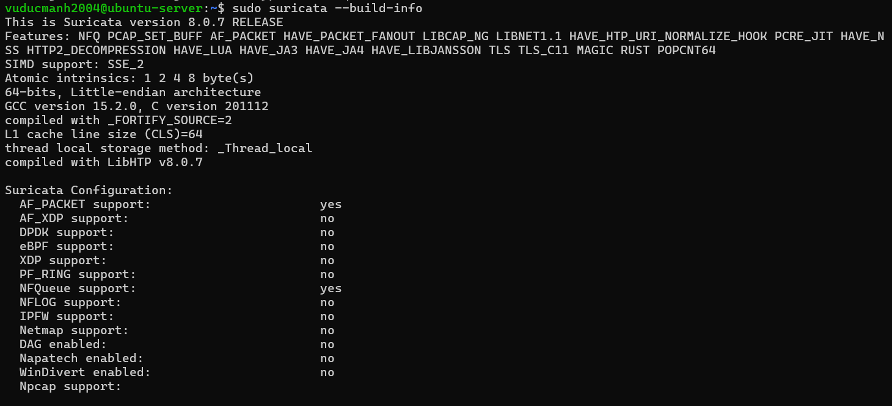  
*Figure 1: Suricata binary verification displaying engine features, LibHTP 0.8.7, and AF_PACKET support[cite: 12].*

### 3.1. Network Binding & Log Destination Setup
Suricata was bound directly to the active hypervisor interface `ens33`[cite: 12]:

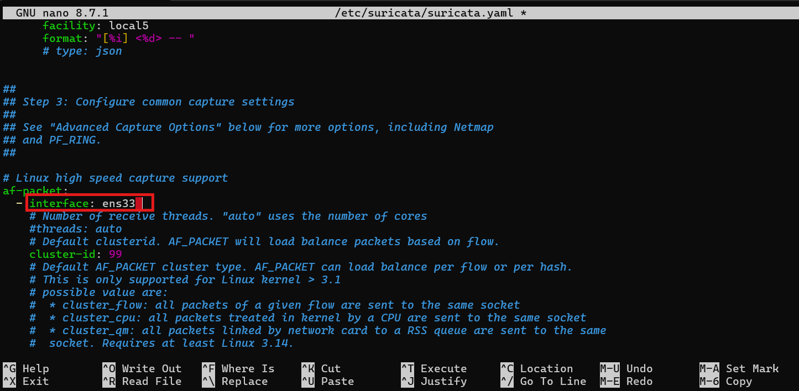  
*Figure 2: Binding Suricata packet capture engine to interface ens33[cite: 12].*

The extensible JSON log output (`eve-log`) was enabled with output path `/var/log/suricata/eve.json`[cite: 12]:

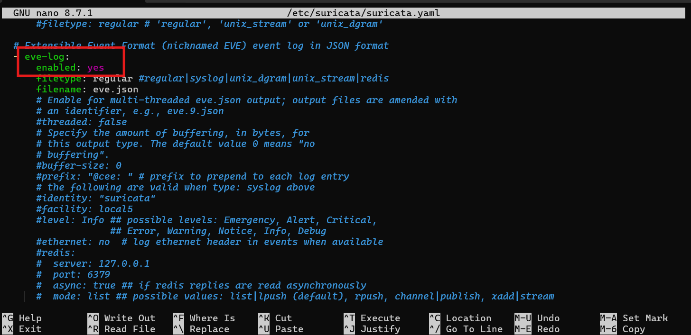  
*Figure 3: Configuration of EVE-JSON structured logging[cite: 12].*

Default rulesets were disabled to eliminate alerting noise, isolating the detection pipeline exclusively to `local.rules`[cite: 12]:

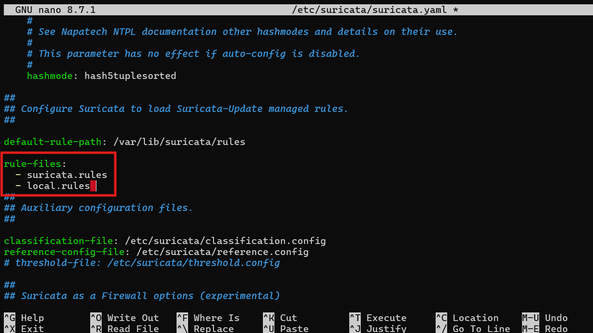  
*Figure 4: Enforcing single-file rule execution via local.rules[cite: 12].*

### 3.2. Custom Detection Rules (`local.rules`)

Six dedicated signatures were crafted to catch specific web attacks against DVWA[cite: 12]:

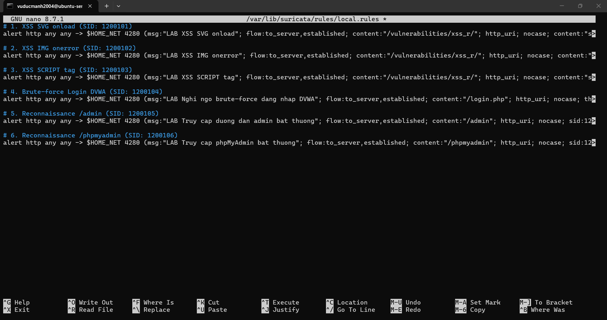  
*Figure 5: Production implementation of custom local.rules signatures[cite: 12].*

```snort
# 1. XSS SVG onload (SID: 1200101)
alert http any any -> $HOME_NET 4280 (msg:"LAB XSS SVG onload"; flow:to_server,established; content:"/vulnerabilities/xss_r/"; http_uri; nocase; content:"<svg"; nocase; content:"onload"; nocase; sid:1200101; rev:1;)

# 2. XSS IMG onerror (SID: 1200102)
alert http any any -> $HOME_NET 4280 (msg:"LAB XSS IMG onerror"; flow:to_server,established; content:"/vulnerabilities/xss_r/"; http_uri; nocase; content:" $HOME_NET 4280 (msg:"LAB XSS SCRIPT tag"; flow:to_server,established; content:"/vulnerabilities/xss_r/"; http_uri; nocase; content:"<script"; nocase; sid:1200103; rev:1;)

# 4. Brute-force Login DVWA (SID: 1200104)
alert http any any -> $HOME_NET 4280 (msg:"LAB Nghi ngo brute-force dang nhap DVWA"; flow:to_server,established; content:"/login.php"; http_uri; nocase; threshold:type both, track by_src, count 5, seconds 20; sid:1200104; rev:1;)

# 5. Reconnaissance /admin (SID: 1200105)
alert http any any -> $HOME_NET 4280 (msg:"LAB Truy cap duong dan admin bat thuong"; flow:to_server,established; content:"/admin"; http_uri; nocase; sid:1200105; rev:1;)

# 6. Reconnaissance /phpmyadmin (SID: 1200106)
alert http any any -> $HOME_NET 4280 (msg:"LAB Truy cap phpMyAdmin bat thuong"; flow:to_server,established; content:"/phpmyadmin"; http_uri; nocase; sid:1200106; rev:1;)
```

### Signature Logic Breakdown:
* **SID 1200101 & 1200102 (DOM/Reflected XSS):** Inspects incoming HTTP GET requests for specific inline JavaScript triggers (`<svg onload=` and `
  ```

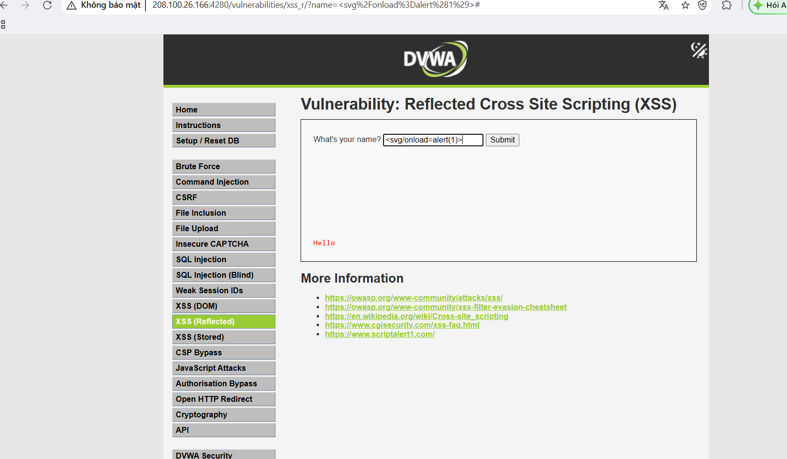  
*Figure 11: Execution of SVG onload XSS payload on DVWA[cite: 12].*

* **SIEM Detection:** Alert flagged in real time with complete source and destination port mapping[cite: 12].

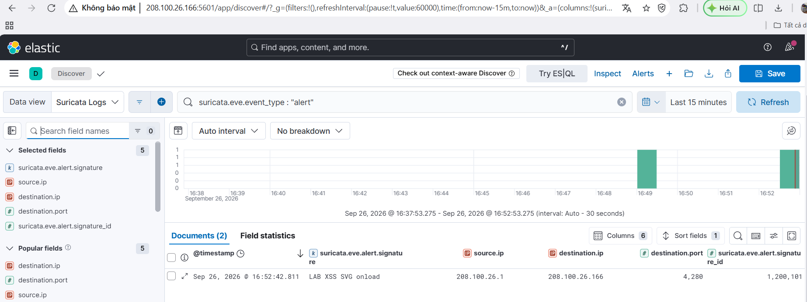  
*Figure 12: Kibana Discover event log validating alert signature "LAB XSS SVG onload" (SID 1200101)[cite: 12].*

---

### 5.3. Scenario 2: Reflected Cross-Site Scripting (IMG Onerror)
* **Objective:** Verify signature `1200102` catching event-handler evasion[cite: 12].
* **Attack Payload:**
  ```text
  [http://208.100.26.166:4280/vulnerabilities/xss_r/?name=](http://208.100.26.166:4280/vulnerabilities/xss_r/?name=)
  ```

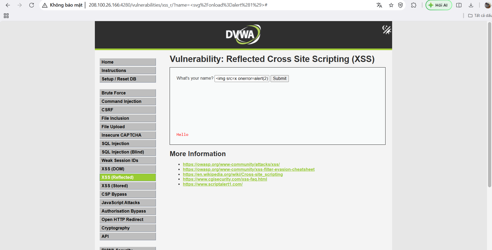  
*Figure 13: Execution of IMG onerror XSS payload on DVWA[cite: 12].*

* **SIEM Detection:** Alert successfully caught and indexed[cite: 12].

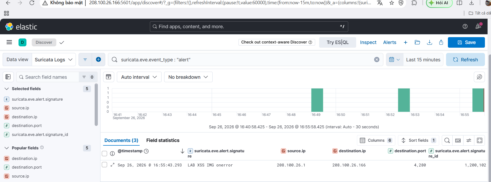  
*Figure 14: Kibana Discover capturing "LAB XSS IMG onerror" (SID 1200102)[cite: 12].*

---

### 5.4. Scenario 3: Automated Authentication Brute-Force
* **Objective:** Trigger threshold-based rule `1200104` by exceeding 5 login attempts within 20 seconds[cite: 10, 12].
* **Attack Execution (from Kali Linux `208.100.26.148`):**[cite: 12]
  ```bash
  for i in {1..10}; do 
    curl -s -i "[http://208.100.26.166:4280/login.php](http://208.100.26.166:4280/login.php)" \
      -d "username=admin&password=wrongpass$i&Login=Login" | head -n 1
    echo "[-] Attempt $i sent"
  done
  ```

  
*Figure 15: Automated authentication spray executed from Kali Linux terminal[cite: 12].*

* **SIEM Detection:** Rate-limit violation caught; document expanded to reveal `url.original: /login.php` and attacker IP `208.100.26.148`[cite: 12].

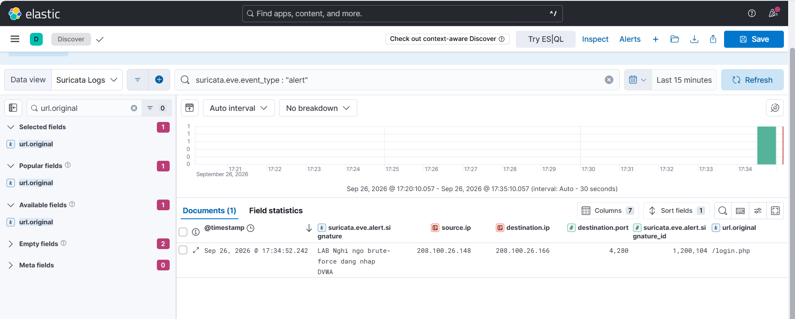  
*Figure 16: Kibana alert event detailing brute-force threshold detection on /login.php[cite: 12].*

---

### 5.5. Scenario 4: Sensitive Directory Reconnaissance
* **Objective:** Detect endpoint enumeration against sensitive administration routes[cite: 12].
* **Attack Execution (from Kali Linux `208.100.26.148`):**[cite: 12]
  ```bash
  curl -s [http://208.100.26.166:4280/admin](http://208.100.26.166:4280/admin)
  curl -s [http://208.100.26.166:4280/phpmyadmin](http://208.100.26.166:4280/phpmyadmin)
  ```

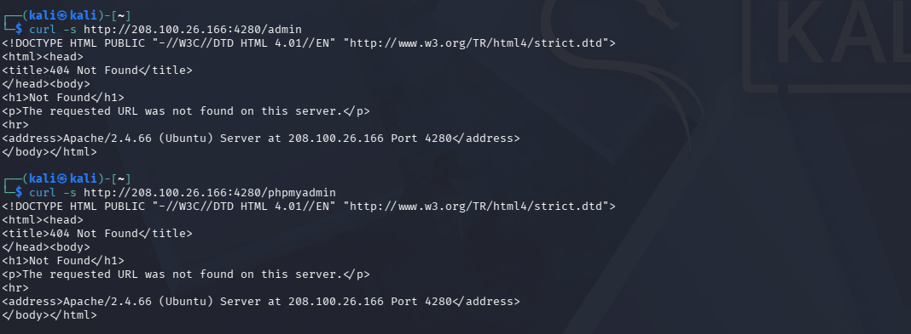  
*Figure 17: Attacker querying non-existent admin endpoints, receiving HTTP 404[cite: 12].*

* **SIEM Detection:** Both probes intercepted and flagged independently[cite: 12].

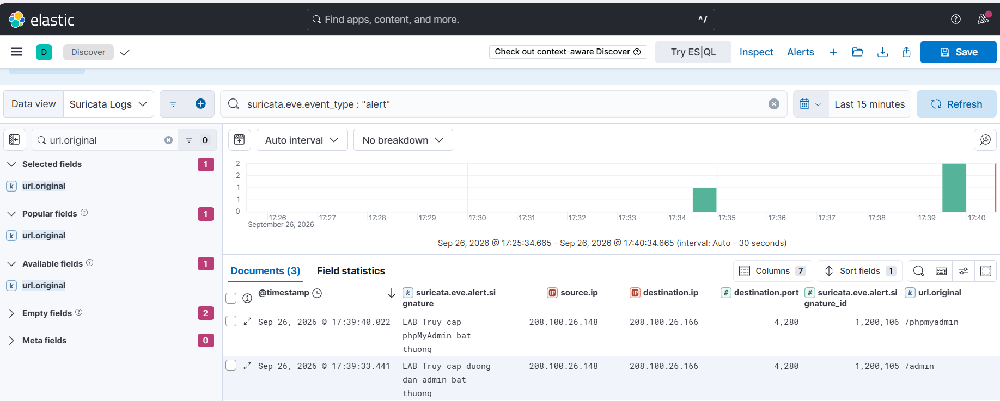  
*Figure 18: Kibana Discover displaying alerts for /admin (SID 1200105) and /phpmyadmin (SID 1200106)[cite: 12].*

---

## 6. SOC Security Operations Dashboard

To empower Tier 1/2 SOC Analysts with operational awareness, a Kibana Security Dashboard was created consolidating aggregate metrics and threat breakdown[cite: 12]:

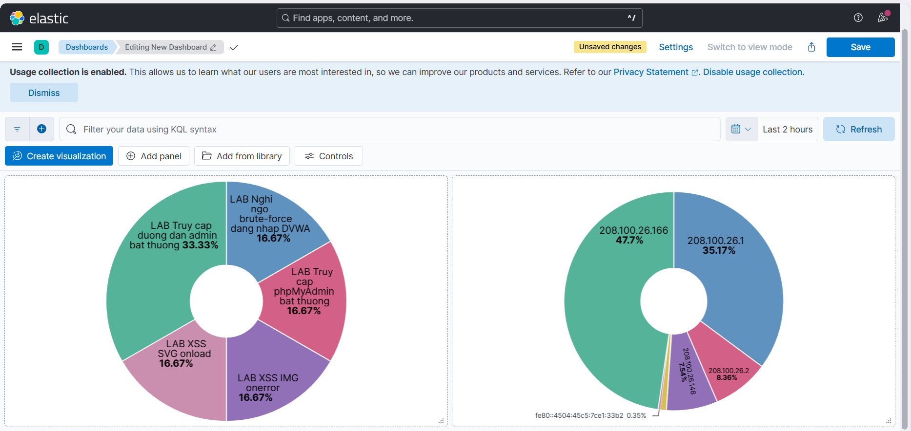  
*Figure 19: Operational SOC Dashboard displaying alert distribution and adversary IP profiling[cite: 12].*

### Analytics Insights:
1. **Threat Category Breakdown (Left Donut Chart):**
   * **Reconnaissance Probing (`33.33%`):** High volume generated by rapid directory enumeration against `/admin` and `/phpmyadmin`[cite: 12].
   * **Cross-Site Scripting (`33.34%` combined):** Evenly divided between SVG-based (`16.67%`) and IMG-based (`16.67%`) injection vectors[cite: 12].
   * **Credential Stuffing / Brute-Force (`16.67%`):** Isolated burst of failed authentication attempts against `/login.php`[cite: 12].
2. **Adversary IP Profiling (Right Donut Chart):**
   * **`208.100.26.148`:** Flagged as an external adversary generating automated attacks (Reconnaissance and Password Spraying)[cite: 12].
   * **`208.100.26.1`:** External user workstation conducting manual application exploitation[cite: 12].
   * **`208.100.26.166`:** Monitored server loopback interface[cite: 12].

---

## 7. Engineering Challenges & Troubleshooting (Post-Mortem)

During lab implementation, four critical technical roadblocks were encountered and resolved:

### 1. Interface Binding Mismatch
* **Root Cause:** The default `/etc/suricata/suricata.yaml` file was configured to sniff packets on interface `eth0`, whereas modern Ubuntu installations under VMware assign interface identifiers such as `ens33`[cite: 12].
* **Resolution:** Reconfigured the `af-packet` section to bind directly to `ens33` and verified with `ip addr show`[cite: 12].

### 2. Space Negation Bug (`EXTERNAL_NET: "!$HOME_NET"`)
* **Root Cause:** When modifying `HOME_NET` to `"any"` for broad testing, Suricata evaluated `EXTERNAL_NET` (defined by default as `!$HOME_NET`) as `!any = NIL`. The engine threw a fatal parsing error: `Rule address range is NIL` and refused to load rulesets.
* **Resolution:** Explicitly defined the host address in `HOME_NET` and assigned `EXTERNAL_NET: "any"`:
  ```yaml
  HOME_NET: "[208.100.26.166,192.168.0.0/16,10.0.0.0/8]"
  EXTERNAL_NET: "any"
  ```

### 3. Elasticsearch Single-Node Master Node Conflict
* **Root Cause:** Elasticsearch failed during startup with `java.lang.IllegalArgumentException: setting [cluster.initial_master_nodes] is not allowed when [discovery.type] is set to [single-node]`.
* **Resolution:** Commented out `cluster.initial_master_nodes` inside `/etc/elasticsearch/elasticsearch.yml`, allowing standalone bootstrap.

### 4. Linux Kernel Loopback Bypass
* **Root Cause:** Initial testing using `curl` executed locally on the Ubuntu Server failed to produce alerts in `/var/log/suricata/fast.log`. The Linux kernel routes intra-host requests through the `lo` (loopback) interface, bypassing the `ens33` network driver where Suricata was sniffing[cite: 12].
* **Resolution:** Shifted all testing to external hosts (Kali Linux and Windows Host) to force traffic through the monitored `ens33` NIC ring buffer[cite: 12].

---

## 8. Repository Structure

```text
.
├── README.md                           # Comprehensive Technical Documentation
├── images/                             # Photographic Evidence (Figures 1-19)
│   ├── 01_suricata_build.png
│   ├── 02_suricata_yaml_interface.png
│   ├── 03_suricata_yaml_eve.png
│   ├── 03b_suricata_rule_files.png
│   ├── 04_local_rules_content.png
│   ├── 05_suricata_test_config.png
│   ├── 06_dvwa_install_running.png
│   ├── 07_filebeat_suricata_module.png
│   ├── 08_all_services_running.png
│   ├── 09_baseline_normal_traffic.png
│   ├── 10_attack_xss_svg.png
│   ├── 11_alert_xss_svg_kibana.png
│   ├── 12_attack_xss_img.png
│   ├── 13_alert_xss_img_kibana.png
│   ├── 14_attack_bruteforce.png
│   ├── 15_alert_bruteforce_kibana.png
│   ├── 16_attack_recon.png
│   ├── 17_alert_recon_kibana.png
│   └── 18_soc_security_dashboard.png
└── configs/                            # System & Pipeline Configurations
    ├── local.rules                     # 6 Custom Suricata Detection Rules
    ├── suricata.yaml                   # Core Engine & Interface Configuration
    ├── elasticsearch.yml               # Tuned Single-Node Elasticsearch Config
    ├── kibana.yml                      # Kibana Host & Port Bindings
    └── suricata-filebeat.yml           # Filebeat Ingest Module Definition
```
